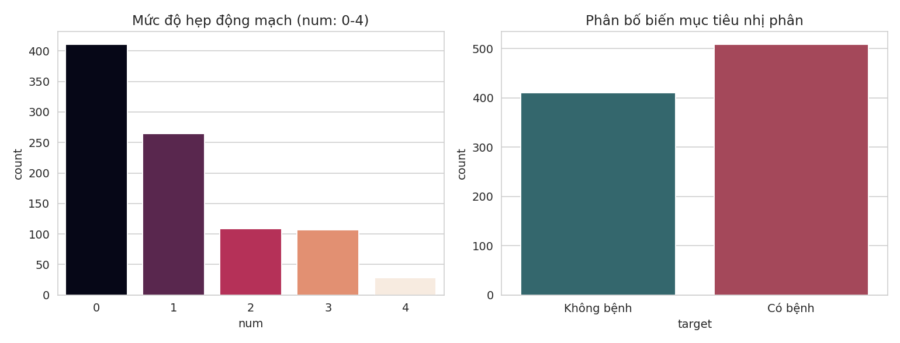
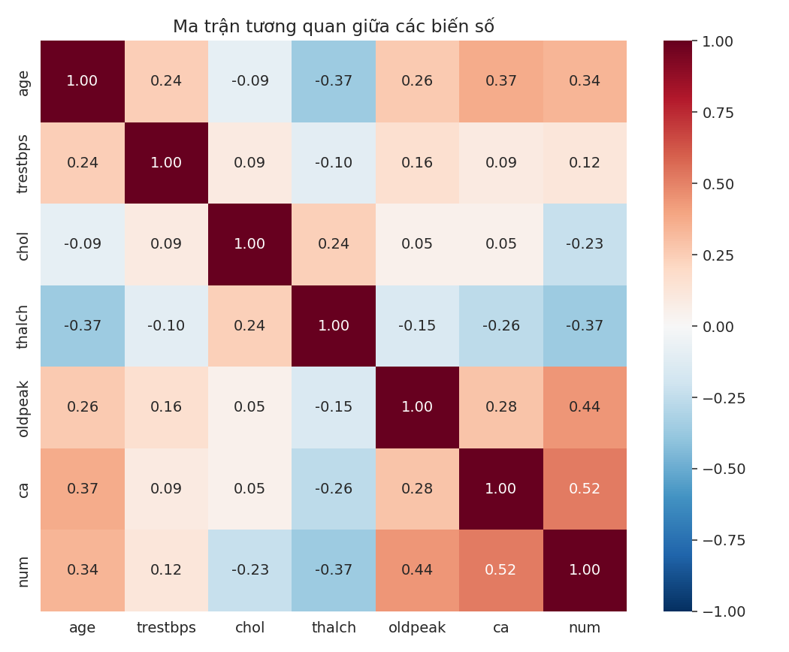
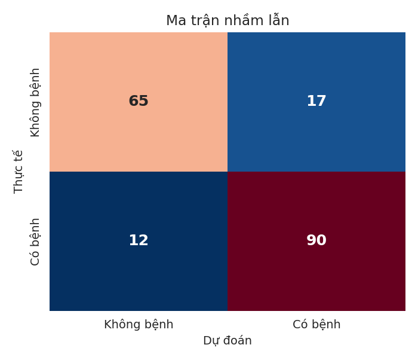
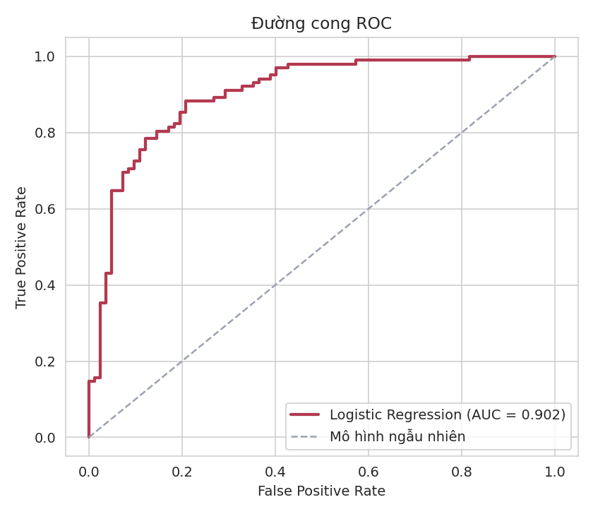
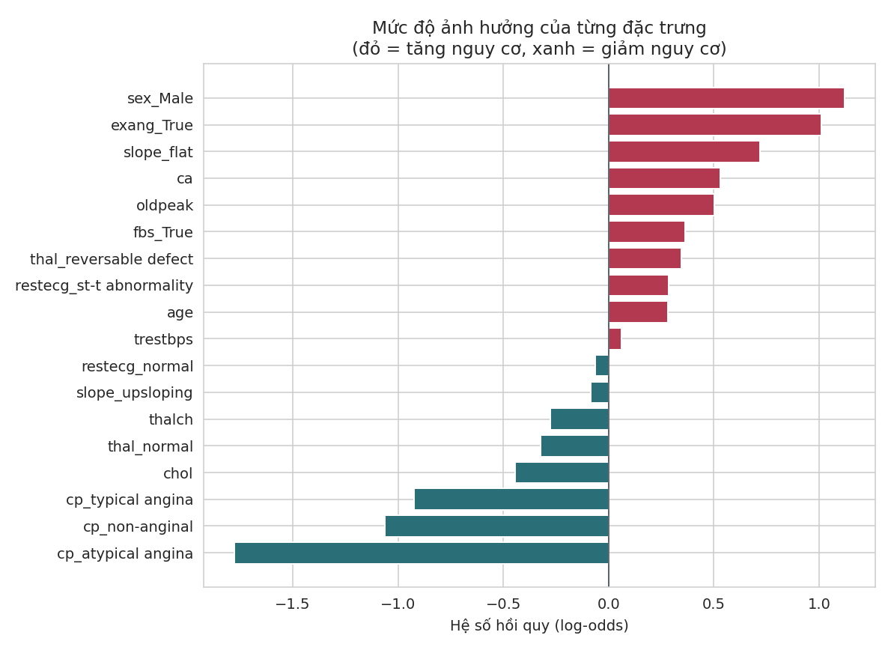

# 🫀 Heart Disease Prediction

Phân tích khám phá dữ liệu (EDA) và xây dựng mô hình **Logistic Regression** để dự đoán nguy cơ mắc bệnh tim từ các chỉ số lâm sàng, sử dụng bộ dữ liệu **UCI Heart Disease** (gộp từ 4 trung tâm y tế: Cleveland, Hungary, Switzerland, VA Long Beach).

## 📋 Mục lục

- [Giới thiệu](#-giới-thiệu)
- [Bộ dữ liệu](#-bộ-dữ-liệu)
- [Cấu trúc thư mục](#-cấu-trúc-thư-mục)
- [Cài đặt](#-cài-đặt)
- [Cách sử dụng](#-cách-sử-dụng)
- [Quy trình phân tích](#-quy-trình-phân-tích)
- [Kết quả](#-kết-quả)
- [Hạn chế & hướng phát triển](#-hạn-chế--hướng-phát-triển)
- [Giấy phép](#-giấy-phép)

## 🩺 Giới thiệu

Dự án gồm hai phần chính, được thực hiện trong `src/heart_disease_analysis.py`:

1. **EDA (Exploratory Data Analysis)** — kiểm tra giá trị thiếu, thống kê mô tả, phân tích đơn biến/hai biến, ma trận tương quan, phát hiện outlier.
2. **Modeling** — xây dựng pipeline tiền xử lý + huấn luyện mô hình **Logistic Regression** để phân loại nhị phân (có bệnh / không bệnh), đánh giá bằng nhiều chỉ số và kiểm định chéo 5-fold.

## 📊 Bộ dữ liệu

File: [`data/heart_disease_uci.csv`](data/heart_disease_uci.csv) — **920 bệnh nhân**, 16 cột gốc, tổng hợp từ 4 trung tâm thu thập dữ liệu.

| Cột | Ý nghĩa |
|---|---|
| `age` | Tuổi |
| `sex` | Giới tính |
| `dataset` | Trung tâm thu thập dữ liệu |
| `cp` | Loại đau ngực (chest pain type) |
| `trestbps` | Huyết áp lúc nghỉ (mm Hg) |
| `chol` | Cholesterol huyết thanh (mg/dl) |
| `fbs` | Đường huyết đói > 120 mg/dl |
| `restecg` | Kết quả điện tâm đồ lúc nghỉ |
| `thalch` | Nhịp tim tối đa đạt được |
| `exang` | Đau thắt ngực do gắng sức |
| `oldpeak` | Độ chênh ST do gắng sức |
| `slope` | Độ dốc đoạn ST khi gắng sức tối đa |
| `ca` | Số mạch máu chính bị hẹp (soi huỳnh quang) |
| `thal` | Kết quả xạ hình tưới máu cơ tim (thalassemia) |
| `num` | Mức độ hẹp động mạch (0 = không bệnh, 1–4 = có bệnh, mức độ tăng dần) |

Từ `num`, script tạo thêm cột **`target`** nhị phân (0 = không bệnh, 1 = có bệnh) dùng làm biến mục tiêu cho mô hình.

**Đặc điểm dữ liệu đáng chú ý:**
- Phân bố mục tiêu khá cân bằng: 411 không bệnh (44,7%) / 509 có bệnh (55,3%).
- Có giá trị thiếu đáng kể ở một số cột: `ca` (66,4%), `thal` (52,8%), `slope` (33,6%) — chủ yếu do khác biệt quy trình thu thập giữa các trung tâm (Cleveland đầy đủ nhất ~99,8%, VA Long Beach thiếu nhiều nhất ~76,7% độ đầy đủ).
- Cột `dataset` (trung tâm thu thập) và `num` (nguồn tạo ra `target`) bị **loại khỏi tập đặc trưng huấn luyện** để tránh rò rỉ dữ liệu (data leakage) và tránh mô hình học "đặc điểm bệnh viện" thay vì đặc điểm lâm sàng thật.

> Nguồn gốc: [UCI Machine Learning Repository – Heart Disease Data Set](https://archive.ics.uci.edu/dataset/45/heart+disease).

## 🗂 Cấu trúc thư mục

```
heart-disease-prediction/
├── app/
│   └── app_heart_disease.py                     # ứng dụng Streamlit dự đoán bệnh tim
├── data/
│   └── heart_disease_uci.csv      # dữ liệu gốc
├── src/
│   └── heart_disease_analysis.py  # đã sửa path tuyệt đối → tương đối
├── assets/
│   └── *.png                      # 5 biểu đồ minh hoạ cho README
├── README.md                      # mô tả dự án + kết quả thực tế
├── requirements.txt
├── .gitignore
└── LICENSE                        # MIT
```

## ⚙️ Cài đặt

```bash
git clone https://github.com/<username>/heart-disease-prediction.git
cd heart-disease-prediction

python -m venv venv
source venv/bin/activate      # Windows: venv\Scripts\activate

pip install -r requirements.txt
```

## ▶️ Cách sử dụng

Chạy toàn bộ script (EDA + huấn luyện mô hình, hiển thị lần lượt từng biểu đồ):

```bash
python src/heart_disease_analysis.py
```

Script dùng cú pháp cell `# %%`, nên cũng có thể mở trong **VS Code** (Python Interactive), **Jupyter**, hoặc **Spyder** để chạy từng ô một.

## 🔬 Quy trình phân tích

1. **Tiền xử lý**
   - Biến số (`age, trestbps, chol, thalch, oldpeak, ca`): điền khuyết bằng **median**, sau đó chuẩn hoá bằng `StandardScaler`.
   - Biến phân loại (`sex, cp, fbs, restecg, exang, slope, thal`): điền khuyết bằng giá trị **xuất hiện nhiều nhất**, sau đó `OneHotEncoder(drop="first")`.
   - Toàn bộ được gói trong một `ColumnTransformer` + `Pipeline` của scikit-learn để tránh rò rỉ dữ liệu giữa tập train/test.
2. **Chia dữ liệu**: `train_test_split` 80/20, giữ nguyên tỷ lệ lớp (`stratify=y`).
3. **Mô hình**: `LogisticRegression(max_iter=1000)`.
4. **Đánh giá**: Accuracy, Precision, Recall, F1-score, AUC-ROC, ma trận nhầm lẫn, đường cong ROC & Precision-Recall, kiểm định chéo `StratifiedKFold` 5-fold trên toàn bộ dữ liệu.
5. **Diễn giải mô hình**: trích xuất hệ số hồi quy và odds ratio của từng đặc trưng để xác định yếu tố ảnh hưởng mạnh nhất đến nguy cơ mắc bệnh.

## 📈 Kết quả

*(Các số liệu dưới đây được ghi lại từ một lần chạy thực tế trên `random_state=42`; kết quả có thể dao động nhẹ nếu chạy lại tuỳ phiên bản thư viện.)*

### Tổng quan dữ liệu





### Hiệu năng mô hình trên tập kiểm tra (20%)

| Chỉ số | Giá trị |
|---|---|
| Accuracy | 0.842 |
| Precision (có bệnh) | 0.84 |
| Recall (có bệnh) | 0.88 |
| F1-score (có bệnh) | 0.86 |
| AUC-ROC | 0.902 |

| | Dự đoán: Không bệnh | Dự đoán: Có bệnh |
|---|---|---|
| **Thực tế: Không bệnh** | TN = 65 | FP = 17 |
| **Thực tế: Có bệnh** | FN = 12 | TP = 90 |




### Kiểm định chéo 5-fold (toàn bộ dữ liệu)

| Chỉ số | Trung bình ± Độ lệch chuẩn |
|---|---|
| Accuracy | 0.826 ± 0.031 |
| AUC-ROC | 0.891 ± 0.022 |

Kết quả CV gần với kết quả trên tập test đơn lẻ, cho thấy mô hình khá ổn định và không bị overfitting nghiêm trọng.

### Đặc trưng ảnh hưởng mạnh nhất



Một số quan sát chính:
- **Giới tính nam** (`sex_Male`) và **đau thắt ngực do gắng sức** (`exang_True`) làm **tăng** đáng kể nguy cơ mắc bệnh (odds ratio ≈ 3,07 và 2,75).
- Các loại đau ngực **không điển hình** (`cp_atypical angina`, `cp_non-anginal`, `cp_typical angina`) đều làm **giảm** nguy cơ so với nhóm tham chiếu (`asymptomatic` — đau ngực "không triệu chứng", vốn là dấu hiệu cảnh báo nguy hiểm ở bệnh tim).
- `slope_flat` (độ dốc ST phẳng), `ca` (số mạch máu bị hẹp) và `oldpeak` (độ chênh ST) đều có tương quan thuận với nguy cơ mắc bệnh, phù hợp với kiến thức lâm sàng.

## ⚠️ Hạn chế & hướng phát triển

- Tỷ lệ giá trị thiếu ở một số cột (`ca`, `thal`, `slope`) khá cao và không đồng đều giữa các trung tâm, có thể ảnh hưởng đến độ tin cậy của các đặc trưng này.
- Mới chỉ thử nghiệm một mô hình tuyến tính (Logistic Regression); có thể mở rộng so sánh với Random Forest, Gradient Boosting (XGBoost/LightGBM), SVM...
- Chưa thực hiện `GridSearchCV`/tối ưu siêu tham số đầy đủ (đã import sẵn nhưng chưa sử dụng — hướng phát triển tiếp theo).
- Đây là mô hình mang tính học thuật/minh hoạ, **không dùng để chẩn đoán y khoa thực tế**.

## 📄 Giấy phép

Phát hành theo giấy phép [MIT](LICENSE). Bộ dữ liệu thuộc về UCI Machine Learning Repository và các tác giả gốc (Andras Janosi, William Steinbrunn, Matthias Pfisterer, Robert Detrano).
